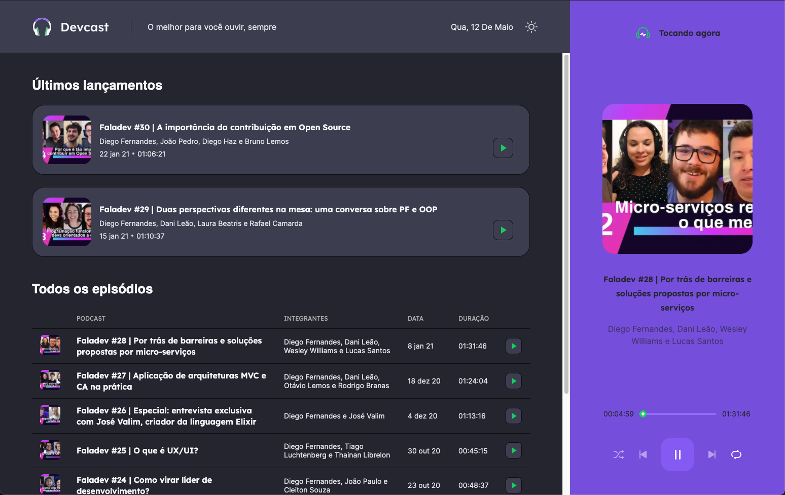
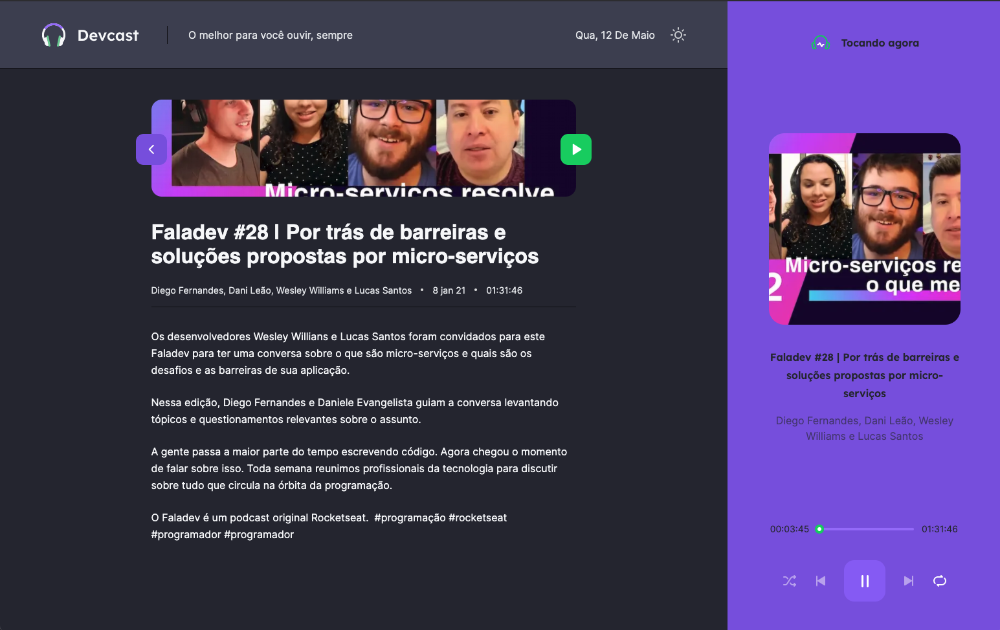

<div align="center">
  
</div>


<h3 align="center">
    🎧  Devcast is a technology podcast for the developer community. 🎧 
</h3>

<p align="center">
  

  

  <a href="https://github.com/kelwys/devcast/commits/master">
    
  </a>

   
   <a href="https://github.com/kelwys/devcast/stargazers">
    
  </a>
</p>

<p align="center">
  <a href="#about-the-project">About The Project</a> |
  <a href="#next-steps">Next Steps</a> |
  <a href="#layout">Layout</a> |
  <a href="#technologies">Technologies</a> |
  <a href="#contribution">Contribution</a> |
  <a href="#author">Author</a> |
  <a href="#license">License</a>
</p>

<h4 align="center">
	🚧 Status: Building 🚀  🚧
</h4>
</br>


<h2 id="about-the-project" > ⏰📈 About The Project </h2>

Listen to the best technology podcast

Project developed during **NLW5** offered by [Rocketseat](https://rocketseat.com.br/) - NLW is an online experience with lots of practical content, challenges and hacks where the content is available for a week.

***You can see [here](https://devcast.vercel.app)!***

<h2 id="next-steps" > ✅ Next steps: </h2>

- [x] Header of the application;
- [x] Player:
  - [x] Play music;
  - [x] Shuffle button - play random podcast;
  - [x] Replay button - replay the podcast;
  - [x] Next button - go to the next podcast;
  - [x] Previous button - go back to the previous podcast;
  - [x] Slide bar - change the time of the podcast.
- [x] Home page:
  - [x] List of the last 2 episodes released on the platform;
  - [x] List with all episodes;
- [x] Episode page:
  - [x] Description and additional information about the episode;
- [x] Black end light theme;
- [x] Replace fake api with real python api
- [ ] Mobile responsive
- [ ] Tests


---

<h2 id="layout" >🎨  Layout </h2>

#### Demo:

#### Home-Page

#### Episode-Page



---

## 🚀 Getting Started

This project contains 2 parts:
Backend and Frontend. First, visit and configure the backend [here](https://github.com/kelwys/devcast-api).

Later, run the development server:

```bash
# Clone Repository
$ git clone https://github.com/kelwys/devcast.git

# Go to server folder
$ cd devcast

# Install Dependencies
$ yarn

# Run Aplication
$ yarn dev

# Access localhost
http://localhost:3000
```
---


<h2 id="technologies"> 🛠 Technologies </h2>

The following tools were used in the construction of the project:

- **[ReactJS](https://reactjs.org)**
- **[Next](https://nextjs.org)**
- **[TypeScript](https://www.typescriptlang.org/)**
- **[css-Modules](https://github.com/css-modules/css-modules)**
- **[Sass](https://sass-lang.com/)**
- **[Axios](https://github.com/axios/axios)**

---

<h2 id="contribution"> 💪 Contribution </h2>

Contributions are what make the open source community such an amazing place to be learn, inspire, and create. Any contributions you make are **greatly appreciated**.

1. Fork the Project
2. Create your Feature Branch (`git checkout -b feature/AmazingFeature`)
3. Commit your Changes (`git commit -m 'Add some AmazingFeature'`)
4. Push to the Branch (`git push origin feature/AmazingFeature`)
5. Open a Pull Request

---

<h2 id="author"> 💻 Author </h2>


 <sub><b>Kelwy Oliveira</b></sub></a> <a href="https://www.linkedin.com/in/kelwyoliveira/" title="kelwy`s linkedin">🚀</a>
 <br />

[](https://www.linkedin.com/in/kelwyoliveira/)
[](mailto:kelwyduarte@gmail.com)

---

<h2 id="license"> 📝 License </h2>

This project is under the [MIT](./LICENSE) license.

---